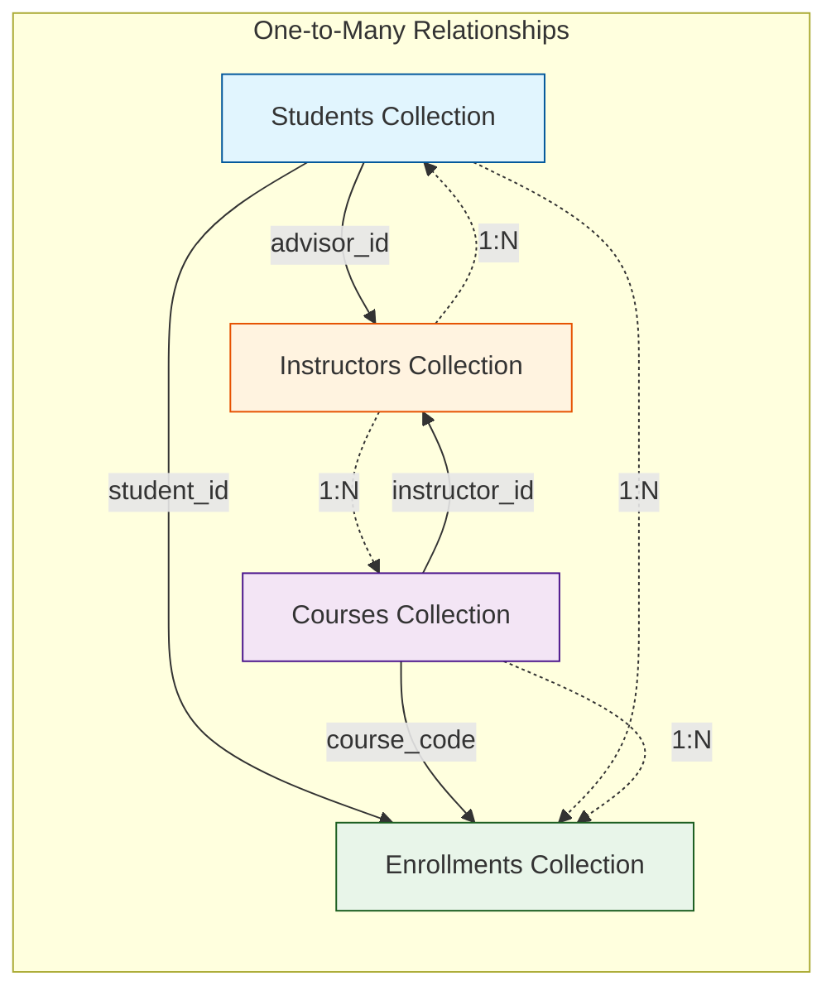
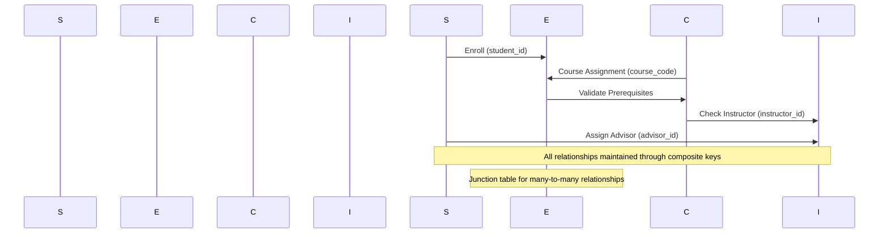
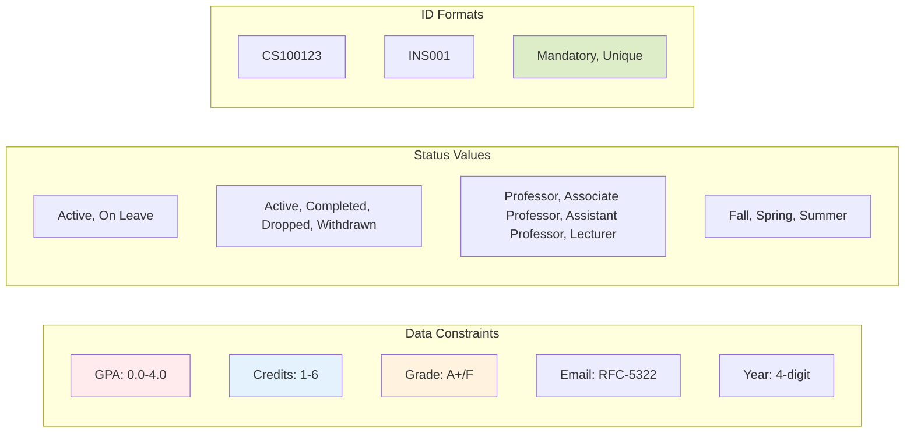
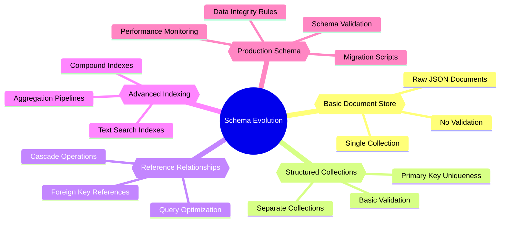

# Database Schema Visual Diagram

## Entity Structure with Field Details

```mermaid
classDiagram
    class Students {
        +string student_id* PK
        +string name.first
        +string name.last
        +string email UK
        +string major
        +string year
        +float gpa
        +int credits_completed
        +string status
        +string advisor_id FK
        +Date enrollment_date
        +DateTime created_at
        +DateTime updated_at
        +create(student_data)
        +find_by_id(student_id)
        +find_all()
        +update(student_id, data)
        +delete(student_id)
    }
    
    class Courses {
        +string course_code* PK
        +string title
        +string description
        +int credits
        +string instructor_id FK
        +string instructor_name
        +string department
        +string semester
        +int year
        +int level
        +int capacity
        +array prerequisites
        +DateTime created_at
        +DateTime updated_at
        +create(course_data)
        +find_by_code(course_code)
        +find_all()
        +update(course_code, data)
        +delete(course_code)
    }
    
    class Instructors {
        +string instructor_id* PK
        +string name.first
        +string name.last
        +string email UK
        +string department
        +string title
        +string specialization
        +Date hire_date
        +string office
        +DateTime created_at
        +DateTime updated_at
        +create(instructor_data)
        +find_by_id(instructor_id)
        +find_all()
        +update(instructor_id, data)
        +delete(instructor_id)
    }
    
    class Enrollments {
        +string student_id* PK/FK
        +string course_code* PK/FK
        +string status
        +string grade
        +Date enrollment_date
        +Date completion_date
        +DateTime created_at
        +DateTime updated_at
        +create(enrollment_data)
        +find_by_student_course(student_id, course_code)
        +find_by_student(student_id)
        +find_by_course(course_code)
        +update(student_id, course_code, data)
        +delete(student_id, course_code)
    }
    
    Students "1" --> "*" Enrollments : enrolls_in
    Courses "1" --> "*" Enrollments : has_enrollments
    Instructors "1" --> "*" Courses : teaches
    Students "*" --> "1" Instructors : advised_by
```

## Schema Relationships Flowchart

## Data Flow Diagram

## Index Strategy Visualization

```mermaid
graph TD
    A[Students Collection] -->|primary| B[student_id: unique]
    A -->|unique| C[email: unique]
    A -->|compound| D[major + gpa]
    A -->|compound| E[year + gpa]
    
    F[Courses Collection] -->|primary| G[course_code: unique]
    F -->|compound| H[instructor_id + semester + year]
    F -->|compound| I[department + semester + year]
    
    J[Instructors Collection] -->|primary| K[instructor_id: unique]
    J -->|unique| L[email: unique]
    
    M[Enrollments Collection] -->|primary| N[student_id + course_code]
    M -->|compound| O[course_code + status]
    M -->|compound| P[student_id + status]
    
    style B fill:#d4edda
    style G fill:#d4edda
    style K fill:#d4edda
    style N fill:#d4edda
    style A fill:#f8f9fa
    style F fill:#f8f9fa
    style J fill:#f8f9fa
    style M fill:#f8f9fa
```

## Validation Rules Diagram

## MongoDB Schema Evolution

